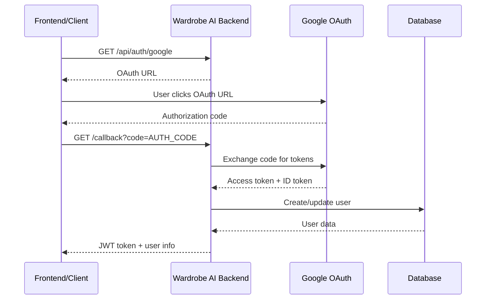

# Google OAuth2 Setup Guide for Wardrobe AI

## Overview
This guide walks you through setting up Google OAuth2 authentication for the Wardrobe AI backend service.

## Prerequisites
- Google Cloud Console account
- Wardrobe AI backend running on `http://localhost:3001`

## Step-by-Step Setup

### 1. Create Google Cloud Project

1. Go to [Google Cloud Console](https://console.cloud.google.com/)
2. Click "Select a project" → "New Project"
3. Name: `wardrobe-ai-auth` (or your preferred name)
4. Click "Create"

### 2. Enable Google OAuth2 API

1. In the Google Cloud Console, navigate to "APIs & Services" → "Library"
2. Search for "Google+ API" or "Google Identity"
3. Enable the "Google Identity Services API"
4. Also enable "Google+ API" if available

### 3. Configure OAuth Consent Screen

1. Go to "APIs & Services" → "OAuth consent screen"
2. Choose "External" (unless you have a G Suite domain)
3. Fill in required fields:
   - **App name**: Wardrobe AI
   - **User support email**: Your email
   - **Developer contact information**: Your email
4. Add scopes:
   - `userinfo.email`
   - `userinfo.profile`
5. Save and continue

### 4. Create OAuth2 Credentials

1. Go to "APIs & Services" → "Credentials"
2. Click "Create Credentials" → "OAuth 2.0 Client IDs"
3. Application type: "Web application"
4. Name: "Wardrobe AI Backend"
5. **Authorized redirect URIs**: Add these URLs:
   ```
   http://localhost:3001/api/auth/google/callback
   http://localhost:3000/auth/callback
   ```
6. Click "Create"
7. **Copy the Client ID and Client Secret** - you'll need these!

### 5. Update Environment Variables

Update your `.env` file in the backend directory:

```bash
# Google OAuth2
GOOGLE_CLIENT_ID=your-actual-client-id-from-step-4
GOOGLE_CLIENT_SECRET=your-actual-client-secret-from-step-4
GOOGLE_CALLBACK_URL=http://localhost:3001/api/auth/google/callback
```

### 6. Restart the Backend Server

```bash
cd E:\LatestFinalCopyofWardrobe\Enhanced\backend
npm run dev
```

## Testing the Implementation

### Option 1: Using Postman

1. Import the collection from `docs/Google_Auth_API_Collection.postman.json`
2. Test the endpoints:
   - `GET /api/auth/google` - Get OAuth URL
   - `POST /api/auth/google/verify` - Verify ID token
   - `GET /api/auth/google/callback` - OAuth callback

### Option 2: Manual Browser Testing

1. Get the OAuth URL:
   ```bash
   curl http://localhost:3001/api/auth/google
   ```

2. Open the returned `authUrl` in your browser
3. Complete Google login
4. You'll be redirected to the callback URL with the result

### Option 3: Using Test Scripts

Run the comprehensive test:
```bash
cd E:\LatestFinalCopyofWardrobe\Enhanced\backend
node test_complete_auth_flow.js
```

## Authentication Flow Overview



## Available Endpoints

| Method | Endpoint | Description |
|--------|----------|-------------|
| `GET` | `/api/auth/google` | Get Google OAuth URL |
| `GET` | `/api/auth/google/callback` | OAuth callback handler |
| `POST` | `/api/auth/google/verify` | Verify Google ID token |
| `POST` | `/api/auth/login` | Regular email/password login |
| `POST` | `/api/auth/register` | Register new user |

## Security Features

✅ **JWT Token Generation**: Secure tokens with 7-day expiration
✅ **Google Token Verification**: Server-side token validation
✅ **User Creation/Linking**: Automatic account creation or linking
✅ **Session Management**: Secure session handling with Passport
✅ **Database Integration**: Full Prisma ORM integration
✅ **Error Handling**: Comprehensive error responses

## Troubleshooting

### Common Issues

1. **"OAuth client not found"**
   - Check GOOGLE_CLIENT_ID is correct
   - Ensure OAuth client is created in correct project

2. **"Redirect URI mismatch"**
   - Verify redirect URIs in Google Console match exactly
   - Check for trailing slashes and http vs https

3. **"Invalid client secret"**
   - Regenerate client secret in Google Console
   - Update GOOGLE_CLIENT_SECRET in .env

4. **Database connection errors**
   - Ensure PostgreSQL is running
   - Check DATABASE_URL in .env

### Test Commands

```bash
# Test server health
curl http://localhost:3001/health

# Test OAuth URL generation
curl http://localhost:3001/api/auth/google

# Run comprehensive tests
node test_complete_auth_flow.js
```

## Next Steps

After setup:
1. Test with real Google account
2. Integrate with frontend application
3. Set up production OAuth credentials
4. Configure HTTPS for production
5. Add additional OAuth providers if needed

## Support

If you encounter issues:
1. Check server logs for detailed error messages
2. Verify all environment variables are set correctly
3. Test with the provided test scripts
4. Review Google Cloud Console settings
